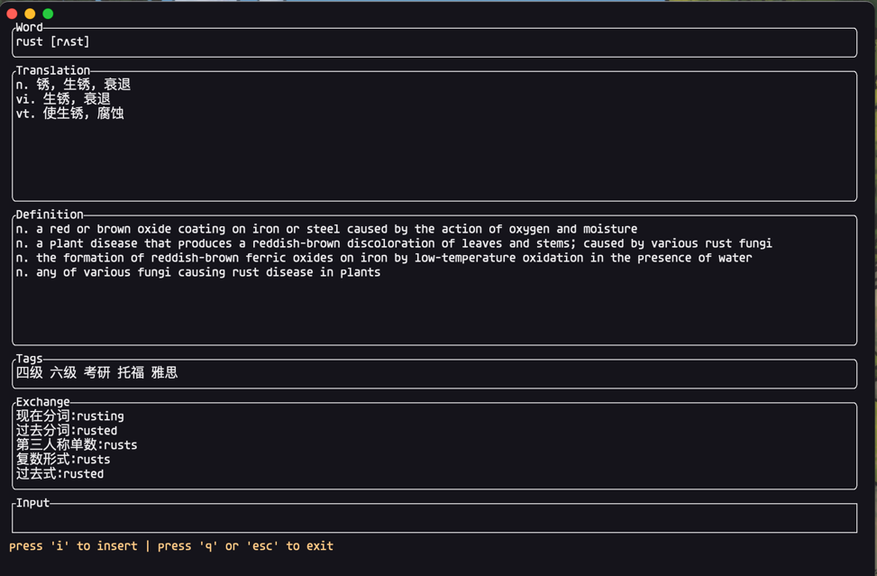

# wd
A tui program for Chinese and English offline dictionaries in the terminal

//TODO

# Credits
- Thanks to [ECDICT](https://github.com/skywind3000/ECDICT) for such a powerful dictionary!

---
##TODO
- [ ] Handling text overflow
- [ ] Using Dynamic Layout
- [ ] colorful
- [ ] .....
